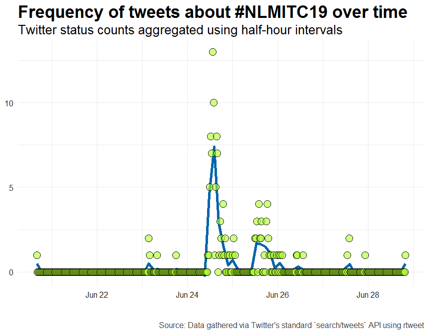
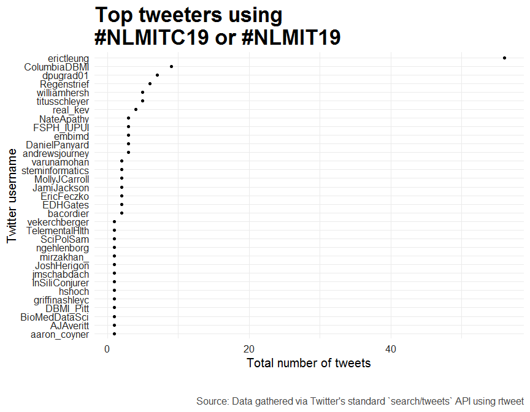
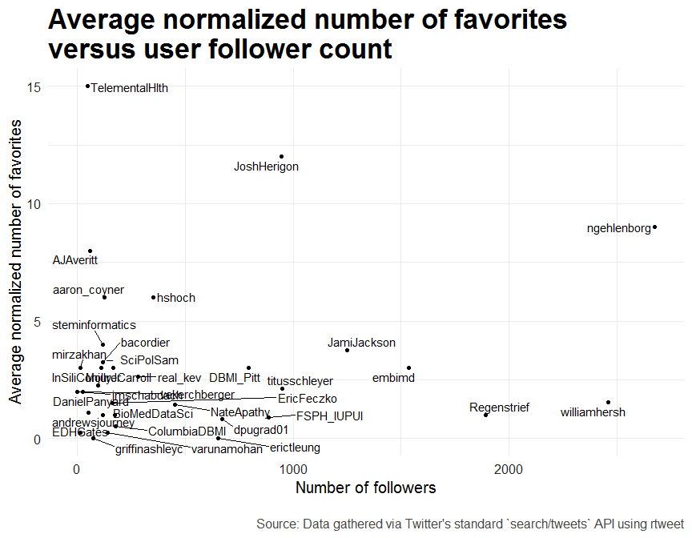
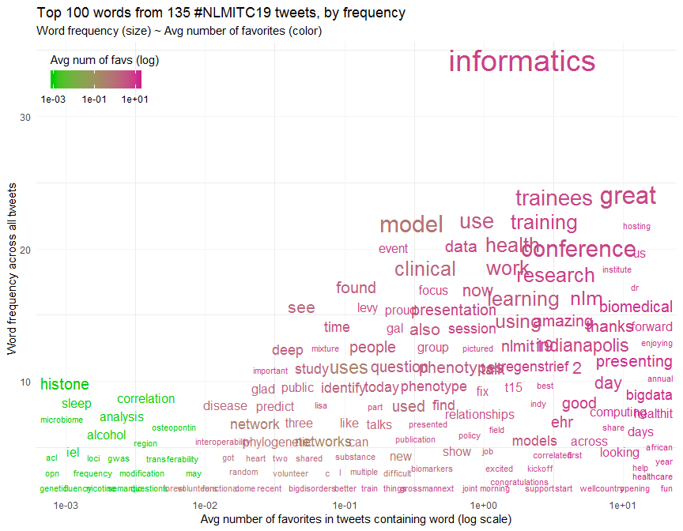

-   [Load libraries](#load-libraries)
-   [Query data](#query-data)
-   [General tweet prevalence over
    time](#general-tweet-prevalence-over-time)
-   [Most prolific tweeters?](#most-prolific-tweeters)
-   [Relationship between follower count and tweet
    popularity](#relationship-between-follower-count-and-tweet-popularity)
-   [Chatterplot of tweet words](#chatterplot-of-tweet-words)
-   [Session information](#session-information)

Load libraries
--------------

    library(tidyverse)
    library(tidytext)
    library(ggrepel)

    if (!requireNamespace("rtweet", quietly = TRUE)) install.packages("rtweet")
    library(rtweet)

Query data
----------

Below is the code to query the Twitter data for the `#NLMITC19`. I ran
this at 2019-06-28 22:50.

    rt <- search_tweets("#NLMITC19 OR #NLMIT19", n = 1800, include_rts = FALSE)

    saveRDS(rt, "nlmitc19_search.rds")
    saveRDS(rt$status_id, "nlmitc19_search-ids.rds")

But instead, here I’ll just look up the status IDs.

    ids_file <- "nlmitc19_search-ids.rds"
    nlmitc19_file <- "nlmitc19_search.rds"

    # Read in search directly if exists
    if (file.exists(nlmitc19_file)) {
      rt <- readRDS(nlmitc19_file)
    } else {
      # Download status IDs file
      download.file(
        "https://github.com/erictleung/ids/blob/master/data/search-ids.rds?raw=true",
        ids_file
      )

      # Read status IDs from downloaded file
      ids <- readRDS(ids_file)

      # Lookup data associated with status ids
      rt <- rtweet::lookup_tweets(ids)
    }

General tweet prevalence over time
----------------------------------

Code modified from
[`rstudioconf_tweets`](https://github.com/mkearney/rstudioconf_tweets).

    rt %>%
      ts_plot("30 minutes", color = "transparent") +
      geom_smooth(method = "loess",
                  se = FALSE,
                  span = 0.05,
                  size = 2,
                  color = "#0066aa") +
      geom_point(size = 5,
                 shape = 21,
                 fill = "#ADFF2F99",
                 color = "#000000dd") +

      # ggplot2 theme 
      theme_minimal(base_size = 15) +
      theme(axis.text = element_text(colour = "#222222"),
            plot.title = element_text(size = rel(1.7), face = "bold"),
            plot.subtitle = element_text(size = rel(1.3)),
            plot.caption = element_text(colour = "#444444")) +

      # Caption information
      labs(title = "Frequency of tweets about #NLMITC19 over time",
           subtitle = "Twitter status counts aggregated using half-hour intervals",
           caption = "\n\nSource: Data gathered via Twitter's standard `search/tweets` API using rtweet",
           x = NULL, y = NULL)

Makes sense considering there were two days of conference time.

Most prolific tweeters?
-----------------------

    rt %>%
      group_by(screen_name) %>%
      summarise(tweets = n()) %>%
      ggplot(aes(x = tweets, y = reorder(screen_name, tweets))) +
      geom_point() +

      # Theme styling information
      theme_minimal(base_size = 15) +
      theme(axis.text = element_text(colour = "#222222"),
            plot.title = element_text(size = rel(1.7), face = "bold"),
            plot.subtitle = element_text(size = rel(1.3)),
            plot.caption = element_text(colour = "#444444")) +

      # Labels
      labs(title = "Top tweeters using\n#NLMITC19 or #NLMIT19",
           x = "Total number of tweets",
           y = "Twitter username",
           caption = "\n\nSource: Data gathered via Twitter's standard `search/tweets` API using rtweet")

Relationship between follower count and tweet popularity
--------------------------------------------------------

Do more followers have more popular tweets?

I take the average number of favorite of an individual’s tweets and
normalize it based on the total number of tweets.

    rt %>%
      # Preprocess and count average favorites normalized by number of tweets
      group_by(screen_name) %>%
      mutate(avg_fav = mean(favorite_count)) %>%
      mutate(avg_norm_fav = avg_fav / n()) %>%
      ungroup() %>%
      select(screen_name, avg_fav, avg_norm_fav, followers_count) %>%
      distinct() %>%

      # Offset to not create infinite values when log transforming
      mutate(followers_count = followers_count + 0.001) %>%
      mutate(avg_norm_fav = avg_norm_fav + 0.001) %>%

      # Plot results
      ggplot(aes(x = followers_count, y = avg_norm_fav, label = screen_name)) +
      geom_text_repel() +
      geom_point() +

      # Use log-scale for x-axis and y-axis
      labs(title = "Average normalized number of favorites\nversus user follower count",
           x = "Number of followers",
           y = "Average normalized number of favorites",
           caption = "\nSource: Data gathered via Twitter's standard `search/tweets` API using rtweet") +

      # Theme styling information
      theme_minimal(base_size = 15) +
      theme(axis.text = element_text(colour = "#222222"),
            plot.title = element_text(size = rel(1.7), face = "bold"),
            plot.subtitle = element_text(size = rel(1.3)),
            plot.caption = element_text(colour = "#444444"))

Chatterplot of tweet words
--------------------------

    rt_no_stop <- rt %>%
      # Just look at tweet text
      select(text, favorite_count) %>%
      
      # Remove web links
      mutate(text = str_replace_all(text, "https?[:graph:]+", "'")) %>%

      # Remove mentions
      # Rule are that names are alphanumeric and can have underscores.
      # Names can also be preceeded with "." or end with some punctuation
      # Twitter:
      #   help.twitter.com/en/managing-your-account/twitter-username-rules
      # To avoid emails:
      #   stackoverflow.com/questions/4424179/how-to-validate-a-twitter-username-using-regex#comment21201837_4424288
      mutate(text = str_replace_all(text,
                                    "\\.?@([:alnum:]|_){1,15}(?![.A-Za-z])[:graph:]?",
                                    "")) %>%

      # Tokenize text to just single words
      unnest_tokens(word, text) %>%

      # Remove stop words (e.g., "a", "the", "and", etc)
      anti_join(get_stopwords())
    ## Joining, by = "word"

    # Get average number of favorites
    rt_word_avg_fav <- rt_no_stop %>%
      # Average favorite count
      group_by(word) %>%
      summarize(avg_fav = mean(favorite_count))

    # Count number of mentions
    rt_counts <- rt_no_stop %>%
      # Create word counts
      count(word, sort = TRUE)

    # Filter low counts and join counts and average favorite score
    chatter_rt <- rt_counts %>%
      filter(n > 1) %>%
      filter(word != "nlmitc19") %>%
      left_join(rt_word_avg_fav, by = "word")

Code below modified from [“RIP wordclouds, long live
CHATTERPLOTS”](https://towardsdatascience.com/rip-wordclouds-long-live-chatterplots-e76a76896098).

    chatter_rt %>%
      # Add small offset average favorite counts because some are zero and we log
      # transform, which can introduce infinite values
      mutate(avg_fav = avg_fav + 0.001) %>%

      # Gather just top 100 mentions
      top_n(100, wt = n) %>%
      
      ggplot(aes(x = avg_fav, y = n, label = word)) +
      geom_text_repel(segment.alpha = 0,
                      aes(colour = avg_fav, size = n)) +

      # Set color gradient,log transform & customize legend
      scale_color_gradient(low = "green3", high = "violetred", 
                           trans = "log10",
                           guide = guide_colourbar(direction = "horizontal",
                                                   title.position = "top")) +
      # Set word size range & turn off legend
      scale_size_continuous(range = c(3, 10),
                            guide = FALSE) +

      # Use log-scale for x-axis
      scale_x_log10() +
      ggtitle(paste0("Top 100 words from ",
                      nrow(rt),
                     " #NLMITC19 tweets, by frequency"),
              subtitle = "Word frequency (size) ~ Avg number of favorites (color)") + 
      labs(y = "Word frequency across all tweets",
           x = "Avg number of favorites in tweets containing word (log scale)",
           colour = "Avg num of favs (log)") +
      
      # minimal theme & customizations
      theme_minimal() +
      theme(legend.position = c(0.20, 0.99),
            legend.justification = c("right","top"),
            panel.grid.major = element_line(colour = "whitesmoke"))

Session information
-------------------

    sessionInfo()
    ## R version 3.5.0 (2018-04-23)
    ## Platform: x86_64-w64-mingw32/x64 (64-bit)
    ## Running under: Windows 7 x64 (build 7601) Service Pack 1
    ## 
    ## Matrix products: default
    ## 
    ## locale:
    ## [1] LC_COLLATE=English_United States.1252 
    ## [2] LC_CTYPE=English_United States.1252   
    ## [3] LC_MONETARY=English_United States.1252
    ## [4] LC_NUMERIC=C                          
    ## [5] LC_TIME=English_United States.1252    
    ## 
    ## attached base packages:
    ## [1] stats     graphics  grDevices utils     datasets  methods   base     
    ## 
    ## other attached packages:
    ##  [1] rtweet_0.6.8    ggrepel_0.8.0   tidytext_0.2.0  forcats_0.4.0  
    ##  [5] stringr_1.4.0   dplyr_0.8.0.1   purrr_0.3.2     readr_1.3.1    
    ##  [9] tidyr_0.8.3     tibble_2.1.1    ggplot2_3.1.0   tidyverse_1.2.1
    ## 
    ## loaded via a namespace (and not attached):
    ##  [1] tidyselect_0.2.5  xfun_0.5          haven_2.1.0      
    ##  [4] lattice_0.20-38   colorspace_1.4-1  generics_0.0.2   
    ##  [7] htmltools_0.3.6   SnowballC_0.6.0   yaml_2.2.0       
    ## [10] rlang_0.3.2       pillar_1.3.1      glue_1.3.1       
    ## [13] withr_2.1.2       modelr_0.1.4      readxl_1.3.1     
    ## [16] plyr_1.8.4        munsell_0.5.0     gtable_0.3.0     
    ## [19] cellranger_1.1.0  rvest_0.3.2       evaluate_0.13    
    ## [22] labeling_0.3      knitr_1.22        broom_0.5.1      
    ## [25] tokenizers_0.2.1  Rcpp_1.0.1        scales_1.0.0     
    ## [28] backports_1.1.3   jsonlite_1.6      stopwords_0.9.0  
    ## [31] hms_0.4.2         digest_0.6.18     stringi_1.4.3    
    ## [34] grid_3.5.0        cli_1.1.0         tools_3.5.0      
    ## [37] magrittr_1.5      lazyeval_0.2.2    janeaustenr_0.1.5
    ## [40] crayon_1.3.4      pkgconfig_2.0.2   Matrix_1.2-16    
    ## [43] xml2_1.2.0        lubridate_1.7.4   assertthat_0.2.1 
    ## [46] rmarkdown_1.12    httr_1.4.0        rstudioapi_0.10  
    ## [49] R6_2.4.0          nlme_3.1-137      compiler_3.5.0
